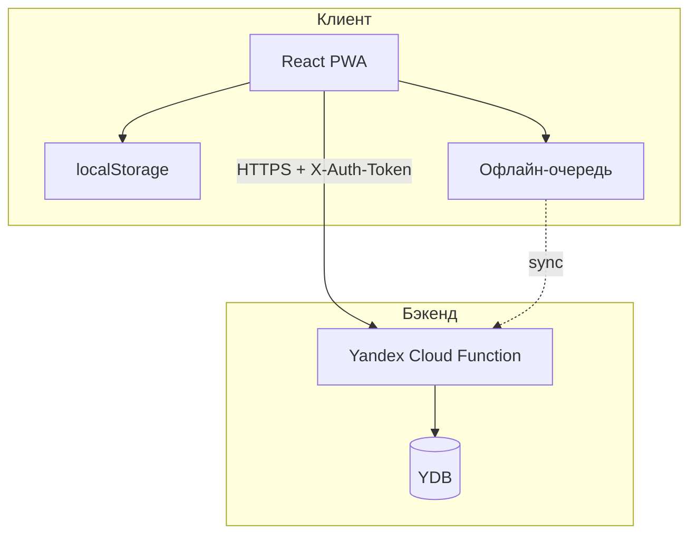

# GymTracker — документация проекта

## Назначение

**GymTracker** — веб-приложение (PWA) для записи и анализа силовых тренировок. Изначально задумывалось как Telegram Mini App с Google Sheets, но эволюционировало в standalone PWA с Yandex Cloud и YDB.

---

## Архитектура



---

## Структура каталогов

```
Gymtracker/
├── front/                 # React-фронтенд
│   ├── src/
│   │   ├── main.tsx       # Точка входа
│   │   ├── App.tsx        # Основной компонент, WorkoutScreen
│   │   ├── api.ts         # API-клиент
│   │   ├── offlineSync.ts # Офлайн-очередь и синхронизация
│   │   ├── types.ts       # Типы данных
│   │   ├── constants.ts   # Константы, buildApiUrl
│   │   ├── exerciseConfig.ts
│   │   ├── utils.ts
│   │   ├── components/
│   │   ├── screens/
│   │   └── ui/
│   ├── public/
│   ├── package.json
│   ├── vite.config.ts
│   ├── tailwind.config.js
│   └── tsconfig.json
├── back/                   # Python-бэкенд
│   ├── index.py           # Yandex Cloud Function handler
│   ├── ydb_store.py       # Работа с YDB
│   ├── requirements.txt
│   ├── make_zip.py
│   ├── run_migration_analytics.py
│   └── legacy_scripts/
├── docs/
│   ├── YDB_SETUP.md
│   ├── YANDEX_CORS_CHECKLIST.md
│   └── DEPLOY_FRONTEND_CURSOR.md
├── Archive/
│   └── knowledge_base/    # Документация и PDF
├── .github/workflows/
│   ├── deploy-frontend.yml
│   └── deploy-backend.yml
├── README.md
├── CONFIGURATION.md
├── DEPLOY.md
├── GIT_SETUP.md
└── GITHUB_PAGES_DEPLOY.md
```

---

## Технологический стек

### Фронтенд

| Пакет | Версия | Назначение |
|-------|--------|------------|
| React | 18.2 | UI |
| TypeScript | 5.2 | Типизация |
| Vite | 5.1 | Сборка |
| TailwindCSS | 3.4 | Стили |
| Framer Motion | 11.18 | Анимации |
| Lucide React | 0.344 | Иконки |
| vite-plugin-pwa | 1.2 | PWA |

### Бэкенд

- Python (Yandex Cloud Function)
- YDB (Yandex Database) — основное хранилище

### Инфраструктура

- **GitHub Pages** — хостинг фронтенда
- **Yandex Cloud Functions** — API
- **YDB** — база данных

---

## Модели данных

### Фронтенд (types.ts)

- **Exercise** — id, name, muscleGroup, description, imageUrl, imageUrl2, equipmentType, weightType, baseWeight, weightMultiplier, allow_1rm
- **WorkoutSet** — id, weight, reps, rest, completed, prevWeight, order, setGroupId, isEditing, rowNumber, pendingId, effectiveWeight, setType, rpe, rir, isLowConfidence
- **ExerciseSessionData** — exercise, note, sets, history
- **GlobalWorkoutSession** — id, date, muscleGroups, duration, exercises
- **AnalyticsDataV4** — mode, frequencyScore, maxGap, returnToBaseline, stabilityGate, baselines, proposals, meta

### Таблицы YDB (ydb_store.py)

| Таблица | Ключевые поля |
|---------|---------------|
| **exercises** | id, name, muscle_group, description, image_url, image_url2, equipment_type, weight_type, base_weight, multiplier |
| **log** | id, date, exercise_id, exercise_name, input_weight, total_weight, reps, rest, set_group_id, session_id, note, ord, set_type, rpe, rir, is_low_confidence |
| **sessions** | id, date, start_ts, end_ts, duration_sec, srpe, body_weight |
| **exercise_muscles** | exercise_id, muscle_group, weight_factor |

---

## Экраны и навигация

| Экран | Файл | Функционал |
|-------|------|------------|
| Home | HomeScreen.tsx | Группы мышц, поиск, история, аналитика |
| Exercises | ExercisesListScreen.tsx | Список упражнений, фильтрация по группе/поиску |
| Workout | App.tsx (WorkoutScreen) | Запись подходов, таймер, суперсеты, PR |
| History | HistoryScreen.tsx | Глобальная история тренировок |
| Analytics | AnalyticsScreen.tsx | Объём нагрузки, ACWR, объём по группам мышц |

Навигация: `home` → `exercises` | `history` | `analytics` → `workout` (при выборе упражнения).

---

## API endpoints

| Метод | Endpoint | Назначение |
|-------|----------|------------|
| GET | `/api/init` | Группы и упражнения |
| GET | `/api/history?exercise_id=` | История по упражнению |
| GET | `/api/global_history` | Глобальная история |
| POST | `/api/save_set` | Сохранение подхода |
| POST | `/api/update_set` | Обновление подхода |
| POST | `/api/delete_set` | Удаление подхода |
| POST | `/api/create_exercise` | Создание упражнения |
| POST | `/api/update_exercise` | Обновление упражнения |
| GET | `/api/analytics` | Аналитика (volume, ACWR, muscleVolume) |
| POST | `/api/start_session` | Начало сессии |
| POST | `/api/finish_session` | Завершение сессии |
| GET | `/api/ping` | Проверка доступности |
| POST | `/api/upload_image` | Загрузка изображения (TODO) |
| POST | `/api/confirm_baseline` | Подтверждение baseline (TODO) |

**Авторизация:** заголовок `X-Auth-Token` (секретный токен в переменной `AUTH_TOKEN`).

**Формат URL для Yandex Cloud:** `?url=/api/<endpoint>` (см. constants.ts, buildApiUrl).

---

## Функциональность

### Тренировки

- Запись подходов: вес, повторения, отдых
- Типы подходов: warmup, working, drop, failure
- RIR (Reps in Reserve): 0, 1, 2, 3+
- Суперсеты (несколько упражнений в одной группе)
- Таймер тренировки
- Автосохранение состояния в localStorage (`gym_workout_state_v2`)
- PR (Personal Record) — отображение и подсветка нового рекорда

### Упражнения

- Типы веса: Dumbbell, Barbell, Bodyweight, Assisted, Kettlebell и др.
- Расчёт эффективного веса: baseWeight + input × multiplier (exerciseConfig)
- Редактирование метаданных (baseWeight, weightMultiplier)
- Загрузка изображений (upload_image — не реализована)

### Офлайн (offlineSync.ts)

- Очередь операций при отсутствии сети (`gym_pending_queue`)
- Синхронизация при восстановлении соединения
- Кэш упражнений (`gym_exercises_cache`)
- Индикатор статуса: online / offline / syncing

### Аналитика

- Volume load (объём нагрузки)
- ACWR (Acute:Chronic Workload Ratio)
- Объём по группам мышц

---

## Конфигурация

### Фронтенд (constants.ts)

| Переменная | Описание |
|------------|----------|
| `VITE_API_BASE_URL` | URL API (по умолчанию: Yandex Cloud Function) |

Ключи localStorage: `gym_auth_token`, `gym_workout_state_v2`, `gym_pending_queue`, `gym_exercises_cache`, `gym_session_id`, `gym_edit_exercise_draft`, `gym_order_counter`, `gym_last_active`.

### Бэкенд

| Переменная | Описание |
|------------|----------|
| `YDB_ENDPOINT` | Endpoint YDB |
| `YDB_DATABASE` | Имя базы данных |
| `AUTH_TOKEN` | Секретный токен для X-Auth-Token |
| `YDB_METADATA_CREDENTIALS` | =1 для metadata credentials |
| `YDB_SERVICE_ACCOUNT_KEY_FILE_CREDENTIALS` | Путь к ключу service account |

---

## Документация и ссылки

| Файл | Содержание |
|------|------------|
| README.md | Устаревший (Telegram + Google Sheets) |
| CONFIGURATION.md | Переменные окружения, API |
| DEPLOY.md | Инструкции по деплою |
| docs/YDB_SETUP.md | Настройка YDB |
| docs/YANDEX_CORS_CHECKLIST.md | CORS для Yandex Cloud |
| back/MIGRATION_ANALYTICS.md | Миграция аналитики |
| knowledge_base/*.pdf | PDF по разработке приложения для силовых тренировок |

---

## Известные TODO

- **api_upload_image** — загрузка в Object Storage или YDB не реализована (возвращает 400)
- **api_confirm_baseline** — логика подтверждения baseline в YDB не реализована
